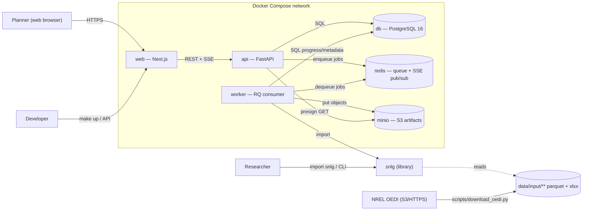

# Architecture — SNLG Platform

Companion to `PRD.md`. Describes the target system: containers, components,
data flow, and repository layout. Reflects decisions D1–D8.

---

## 1. System context



- **Trust boundary:** everything in *Platform* runs on a trusted LAN / a
  single host. External surface is `web` (3000) and `api` (8000).
- **Engine is a library**, not a service. Only `worker` imports it at
  runtime; `api` imports only its **Pydantic schema mirror** for validation.

---

## 2. Containers (Compose services)

| Service | Image / build | Responsibility | Key ports / deps |
|---|---|---|---|
| `web` | `web/Dockerfile` (node 20) | Next.js UI (Pages Router, MUI). SSR + client. Talks to `api` only. | 3000 → api |
| `api` | `api/Dockerfile` (python 3.11 + uv) | FastAPI. Config CRUD/validate, run lifecycle, results read, presigned URLs, SSE relay. Stateless. | 8000 → db, redis, minio |
| `worker` | same image as `api`, different entrypoint (`rq worker`) | Executes ensembles via `snlg.run`. Writes progress + metadata to `db`, artifacts to `minio`, publishes progress events to `redis`. Horizontally scalable (`--scale worker=N`). | → db, redis, minio, `data/` volume |
| `db` | `postgres:16` | System of record for configs, runs, metrics, lineage. Named volume. | 5432 |
| `redis` | `redis:7` | RQ job queue + pub/sub channel for run progress (SSE fan-out). | 6379 |
| `minio` | `minio/minio` | S3-compatible artifact store. Console on 9001. Named volume. | 9000 / 9001 |
| `minio-init` | `minio/mc` (one-shot) | Creates the `snlg-artifacts` bucket + service account on first `up`. | exits 0 |

`data/` (host bind mount) holds the large ResStock/ComStock inputs, shared
read-only into `worker`. Outputs go to MinIO, **not** the bind mount
(the legacy `data/output/scenario_runs/` tree remains only for the headless
CLI / notebook path).

---

## 3. Component view — `api`

```
api/microgrid_api/
  main.py            FastAPI app factory, router mounts, lifespan (redis/minio clients)
  settings.py        Pydantic-settings: DATABASE_URL, REDIS_URL, S3_*, API_TOKEN
  db.py              Engine, SessionLocal, get_db dependency
  models.py          SQLAlchemy 2.0 models: Config, ConfigVersion, Run, RunMetric, Artifact
  schemas/
    scenario.py      Pydantic mirror of snlg.config.ScenarioConfig (D6) + validate()
    config_api.py    ConfigCreate/Update/Out, YAML import/export DTOs
    run_api.py       RunCreate, RunOut, RunDetailOut, RunProgressEvent
    results_api.py   RunMetricOut, EnsembleSummaryOut, ArtifactOut, SeriesOut
  routers/
    health.py        GET /health, GET /ready
    configs.py       CRUD, /validate, /clone, /import, /{id}/export, versions
    runs.py          POST /runs, GET /runs, GET /runs/{id}, POST /runs/{id}/cancel,
                     GET /runs/{id}/events  (SSE)
    results.py       GET /runs/{id}/metrics, /summary, /artifacts, /series/{kind}
  queue.py           RQ Queue factory; enqueue_run(run_id)
  storage.py         Storage protocol + S3Storage + LocalStorage (tests)
  progress.py        Redis pub/sub helpers; publish_progress / subscribe
  auth.py            require_token dependency (D7)
```

## 4. Component view — `worker`

```
api/microgrid_api/worker/
  __main__.py        `python -m microgrid_api.worker` → rq worker bootstrap
  tasks.py           run_ensemble_task(run_id): the RQ job
  runner.py          orchestrates: load config → snlg.run(...) with callbacks
                     → persist metrics → upload artifacts → finalize status
  cancellation.py    cooperative cancel: checks a redis flag between runs
  artifacts.py       serializes EnsembleResult → CSV/Parquet/PNG → Storage.put
```

`runner.py` calls **only** `snlg.run.run_scenario`. The engine receives:

- `config: dict` (validated JSON from the DB),
- `progress: Callable[[RunProgress], None]` → writes a `run_metrics` row and
  `publish_progress(run_id, event)`,
- `artifacts: ArtifactSink` → the worker's `artifacts.py`, invoked per
  artifact so memory is released incrementally,
- `should_cancel: Callable[[], bool]`.

## 5. Component view — `snlg` engine (existing; see `engine-reference.md`)

```
snlg/
  __init__.py     re-exports; __version__
  _types.py       dataclasses: ArchetypePool, NeighborhoodComposition,
                  BuildingSelection, PerturbedProfile, NeighborhoodResult, EnsembleResult
  config.py       YAML → ScenarioConfig dataclasses; validate_config()
  rng.py          RNGBundle (composition/archetype/perturbation); make/derive
  archetype.py    Section 1 — filter ResStock/ComStock chars → ArchetypePool
  loader.py       parquet I/O (lru_cache), MF unit scaling, 15-min → hourly
  composition.py  Sections 2–3 — dirichlet / uniform_renorm → integer counts; select buildings
  perturbation.py Section 4 — temporal shift + end-use lognormal factors (off by default)
  aggregation.py  Section 5 — sum profiles; peak / energy / load factor / coincidence
  feasibility.py  Section 6 — hard accept/reject + soft penalty score
  ensemble.py     Sections 7–8 — the run loop + convergence check
  validation.py   Section 11 — per-sample + distributional + structural checks
  outputs.py      Section 9 — legacy-compatible CSV/PNG writers
  run.py          NEW (FE-1) — run_scenario() façade: the only platform entry point
  cli.py          NEW (FE-5) — `python -m snlg run ...`
```

---

## 6. End-to-end sequence — launch a run (UJ-1)

```mermaid
sequenceDiagram
  participant U as Browser
  participant W as web
  participant A as api
  participant R as redis
  participant K as worker
  participant D as db
  participant M as minio

  U->>W: Launch run (config_id, overrides)
  W->>A: POST /runs {config_id, overrides}
  A->>D: validate config snapshot; INSERT run(status=queued)
  A->>R: enqueue run_ensemble_task(run_id)
  A-->>W: 202 {run_id, status: queued}
  W->>A: GET /runs/{id}/events (SSE)
  K->>R: dequeue job
  K->>D: UPDATE run(status=running, started_at)
  loop each Monte Carlo run
    K->>K: snlg.run → progress(RunProgress)
    K->>D: INSERT run_metric(run_index, peak_kw, ...)
    K->>R: PUBLISH progress:{run_id} event
    R-->>A: event
    A-->>W: SSE data: event
  end
  K->>M: PUT artifacts (per-run CSV, envelopes, figures, compiled)
  K->>D: INSERT artifact rows; UPDATE run(status=succeeded, finished_at, summary jsonb)
  K->>R: PUBLISH progress:{run_id} {stage: done}
  A-->>W: SSE done
  U->>W: Open results dashboard
  W->>A: GET /runs/{id}/summary, /series/envelope, /artifacts
  A->>M: presign GET for artifact downloads
  A-->>W: JSON + presigned URLs
```

---

## 7. Data flow & storage split (D3, D5)

| Data | Store | Shape |
|---|---|---|
| Scenario config (canonical) | Postgres `configs.body jsonb` + `config_versions` | validated JSON |
| Run record & lifecycle | Postgres `runs` | status, timestamps, engine_version, seeds, config snapshot jsonb |
| Per-Monte-Carlo-run scalars | Postgres `run_metrics` | (run_id, run_index, peak_kw, annual_energy_kwh, load_factor, soft_score, feasible) |
| Ensemble summary | Postgres `runs.summary jsonb` | diversity_metrics, convergence_history, validation_report, n_attempted/feasible/rejected, converged |
| Hourly 8760 series (per run, per representative case, envelopes) | **MinIO** Parquet | `runs/{run_id}/series/...parquet` |
| Legacy per-run + compiled CSVs | **MinIO** | `runs/{run_id}/csv/...` |
| Figures (summary PNG, load-duration PNG) | **MinIO** | `runs/{run_id}/figures/...` |
| Artifact index | Postgres `artifacts` | (run_id, kind, object_key, content_type, bytes, sha256) |
| Input building data | Host volume `data/input/**` | parquet + xlsx (provisioned by OEDI script) |

Rule of thumb: **if it's a scalar or you'll filter/sort on it, Postgres; if
it's an array or a file, MinIO.**

---

## 8. Repository layout (target)

```
Community Load Profiles/
  snlg/                        # D1 — standalone installable library
    pyproject.toml             #   name = "snlg", semver, changelog
    src/snlg/...               #   (moved from ./src/snlg — update imports/CI)
    tests/                     #   engine unit + contract + determinism tests
    CHANGELOG.md
  api/                         # FastAPI + RQ worker (depends on snlg)
    pyproject.toml
    microgrid_api/...
    alembic/  alembic.ini
    tests/
    Dockerfile
  web/                         # Next.js app (harvested from feat/* foundation)
    package.json
    src/{pages,components,lib,styles}/...
    e2e/                       # Playwright
    Dockerfile
  deploy/
    docker-compose.yml
    docker-compose.ci.yml      # overrides: fixture data, tiny run
    .env.example
    minio-init.sh
  scripts/
    download_oedi.py           # FD-3 (harvest from feat/oedi-downloader)
    seed.py                    # FD-5
  data/                        # bind-mounted inputs (gitignored except fixtures)
    input/{resstock,comstock}/...
    background/*.xlsx
  tests/fixtures/data/         # committed tiny dataset for CI
  notebooks/                   # kept; now `pip install -e ./snlg` instead of sys.path hack
  configs/scenarios/*.yaml     # kept as import fixtures / templates
  docs/                        # this PRD + specs
  Makefile
  .github/workflows/ci.yml
```

> **Migration note:** moving `src/snlg` → `snlg/src/snlg` is optional but
> recommended (clean package boundary). If the agent keeps `src/snlg` in
> place, it MUST still add a `pyproject.toml` that makes `import snlg` work
> via `pip install -e .` and set `pythonpath`/`packages` so the root `pytest`
> needs no `PYTHONPATH` (A1). `implementation-plan.md` Phase 1 decides.

---

## 9. Technology choices

| Concern | Choice | Notes |
|---|---|---|
| Engine language | Python 3.11 (min 3.10) | numpy 2, pandas 2, pyarrow, scipy, pvlib, pyyaml |
| API framework | FastAPI + uvicorn | matches `feat/*`; async endpoints, OpenAPI free |
| ORM / migrations | SQLAlchemy 2.0 + Alembic | matches `feat/*` |
| Validation | Pydantic v2 / pydantic-settings | schema mirror of dataclasses (D6) |
| Queue | Redis 7 + RQ | simpler than Celery at this scale (D2) |
| DB | PostgreSQL 16 | plain; not Timescale (D5) |
| Object store | MinIO (S3 API) via `boto3` | `boto3` already a dependency |
| Frontend | Next.js 14 (Pages Router), React 18, TypeScript, MUI 5 | matches `feat/frontend-foundation-nextjs` |
| Charts | Recharts (or visx) | see `frontend-spec.md` §5 |
| Frontend tests | Jest + React Testing Library; Playwright e2e | Jest config already in `feat/*` |
| Python tests | pytest, pytest-cov; `httpx`/`ASGITransport` for API; `fakeredis` for queue | |
| Lint/format | ruff + black (py); eslint + prettier (ts) | |
| Container orchestration | Docker Compose v2 | one file + a CI override (D4) |
| CI | GitHub Actions | `.github/workflows/ci.yml` (FD-4) |

---

## 10. Cross-cutting concerns

- **Reproducibility:** every `run` row stores `engine_version`
  (`snlg.__version__`), the three RNG seeds, and a **frozen JSON snapshot**
  of the config at launch. Re-running that snapshot must reproduce
  `run_metrics` exactly (A5).
- **Config/engine schema parity:** a contract test loads every YAML in
  `configs/scenarios/`, runs it through the Pydantic validator **and**
  `snlg.config` parsing, and asserts equivalence (mitigation for the
  drift risk).
- **Observability:** structured JSON logs from api + worker; `/health`
  (liveness) and `/ready` (db + redis + minio reachable). Run logs are
  captured to `runs.log_text` (tail) + a full-log artifact in MinIO.
- **Security:** `API_TOKEN` bearer on mutations; MinIO not exposed outside
  the Compose network except the console; no secrets in images (all via
  `.env`). CORS locked to the `web` origin.
- **Failure handling:** worker wraps each job in try/finally; on exception
  → `run.status=failed`, `error_message`, partial artifacts tagged
  `partial=true`. RQ retries disabled for v1 (a failed ensemble is a
  user-visible event, not a transient).
